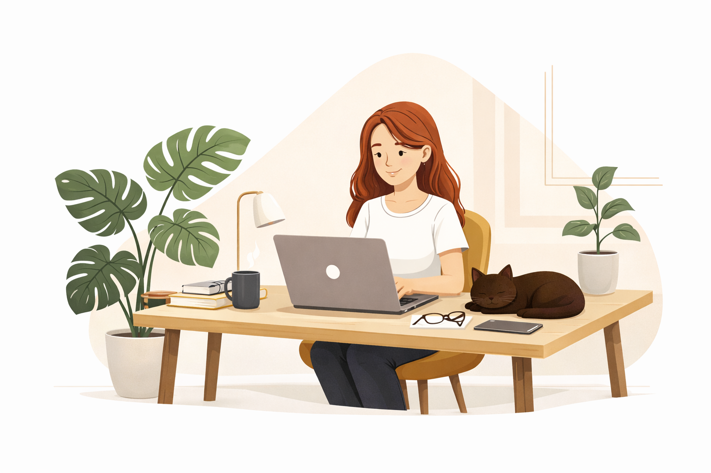

  

✨ Oi, eu sou a Lais

 

Sou desenvolvedora front-end. Gosto de código bem escrito, interface bem pensada e produto que não exclui pessoas pelo caminho.
 

Comecei no front ainda na faculdade e foi construindo coisas do zero que me apaixonei por UX e pela forma como decisões visuais e técnicas afetam quem está do outro lado da tela. Depois disso, passei por empresas maiores, times multidisciplinares e muito código legado — o que me ensinou a respeitar contexto, histórico e impacto antes de sair refatorando tudo.
 

Hoje meu foco está em **acessibilidade para web** e **design systems**. Não como tendência, mas como responsabilidade. Acredito que componentes só são bons de verdade quando são reutilizáveis, acessíveis e fáceis de manter — para quem usa e para quem desenvolve.

Me interesso especialmente por:
- React e TypeScript  
- Design systems vivos (não só bibliotecas de componentes)  
- HTML semântico, ARIA e navegação por teclado  
- Interfaces simples para problemas complexos  
- Evoluir produto sem quebrar quem já depende dele  

📫 Onde me encontrar:   
 &nbsp;&nbsp;&nbsp;
 

<i>Se você acredita que tecnologia também é sobre cuidado, provavelmente a gente vai se entender.</i>

